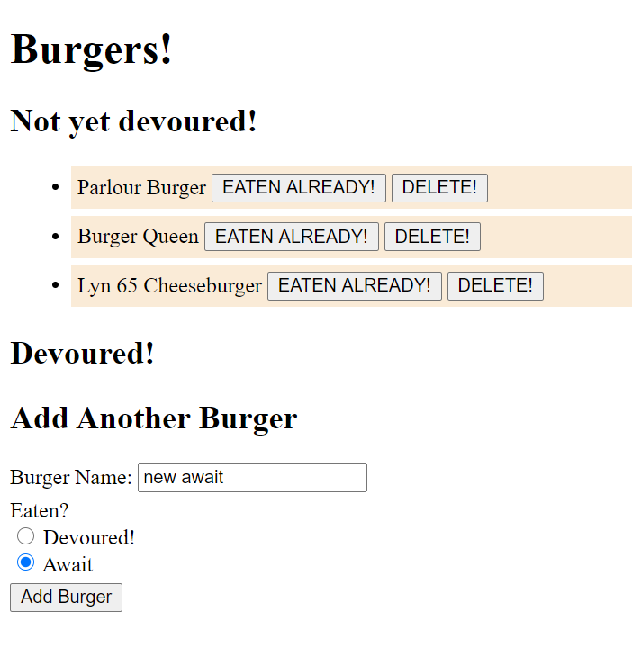

# Department, Role, and Employee Management
The purpose of this application would be for users to view burger lists to be eaten, have been eaten, and to add/submit more to eat. When submitting a burger, the item automatically goes to the Not Yet Devoured list; once eaten, the burger moves to the Devoured list.
 The application with the assignment is VERY similar to class activity 17 (cats) and had potential Delete buttons.

**Created On**: `2020 October 30`
 
Deployment: https://tranquil-lake-26395.herokuapp.com/
 
Repository: https://github.com/charlinelach/burgerQueen

## Table of Contents
* [Usage](#usage)
* [Installation](#installation)
* [Credits & Thank You](#credits)
* [Testing & Errors](#testing)
* [License](#license)

# Development

## Usage Instructions
To utilize the application, the user would access the application via [Heroku](https://tranquil-lake-26395.herokuapp.com/) link.
 
Ideally, the user would view burgers that are on the list but not yet eaten. With an Eaten Already button, that would mark the burgers as Devoured and move them to the other list. There is also a Delete button, which would remove the item from the table/list of burgers.
 
When adding another burger, the user would be able to choose the burger name and whether they have been eaten yet or not.

## Installation
N/A when on Heroku

## Credits
Shout out to the wonderful instructor, TAs, and classmates!
 
This homework was hard and incomplete. Thank you to whomever grades this and putting up with it!

## Testing
Testing was completed locally on Visual Studio with no successful outputs.

# License
MIT License  
Copyright (c) 2020